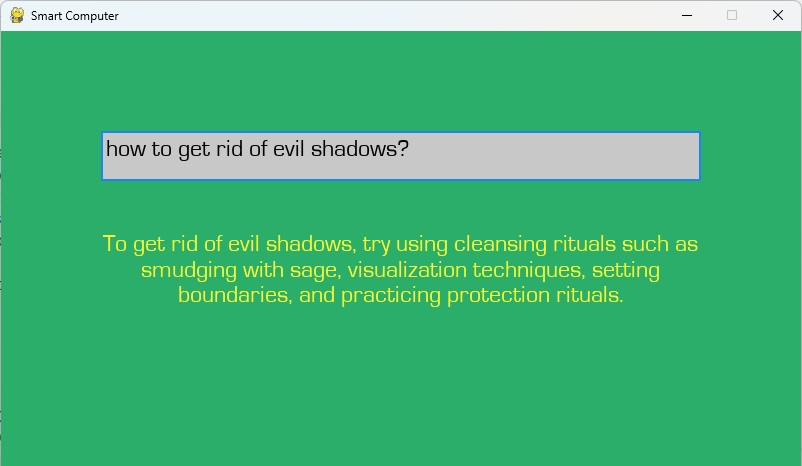

# couragecomputergpt
implements courage the cowardly dog computer powered by chat gpt
# Free to use
get your chat gpt api key by following these intructions and paste it in backend.py
https://pimylifeup.com/raspberry-pi-chatgpt/
You don't need raspberry pi, it will run on any windows/linux computer with python

# Output

